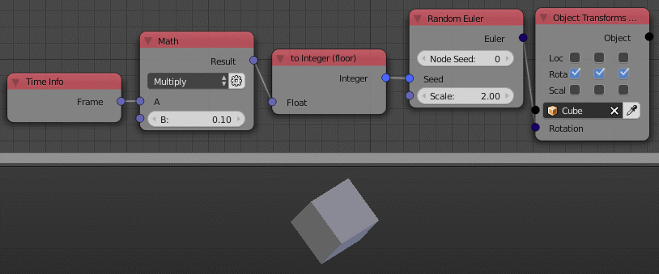

Random Euler
============

Description
-----------

This node generates a random euler with a defined range.

.. image:: images/random_euler_node.png
   :width: 160pt

Inputs
------

- **Seed** - Seed for the random generator, where different seed generates different random euler.
- **Scale** - The range in positive and negative directions in radian.

Outputs
-------

- **Euler** - A random euler.

Advanced Node Settings
----------------------

- N/A

Note
----

The node has an **extra seed** (*Node Seed*) that can be used to differentiate between nodes with the same seed, e.g., When using multiple *Random euler* nodes in a loop while using the index as a seed, you can change the extra seed to get different results from the other nodes.

Animation Nodes automatically changes the *Node Seed* when you duplicate or add a new *Random euler* node.

Examples of Usage
-----------------

