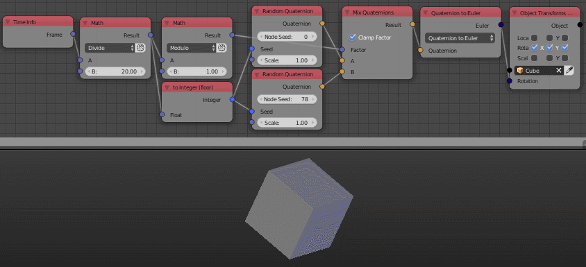

Random Quaternion
=================

Description
-----------
This node generate a random quaternion.

.. image:: images/random_quaternion_node.png
   :width: 160pt

Inputs
------

- **Seed** - Seed for the random generator, Where different seed generate different random quaternion.
- **Scale** - Scale of the quaternion elements.

Outputs
-------

- **Quaternion** - A random quaternion.

Advanced Node Settings
----------------------

- N/A

Note
----

The node has an **extra seed** (*Node Seed*) that can be used to differentiate
between nodes with the same seed, e.g., When using multiple *Random quaternion*
nodes in a loop while using the index as a seed, you can change the extra seed
to get different results from the other nodes.

Animation Nodes automatically change the *Node Seed* when you duplicate or add
a new *quaternion vector* node.

Examples of Usage
-----------------

