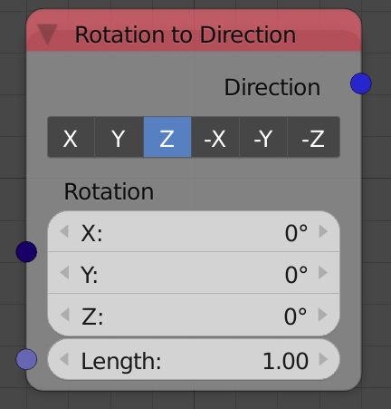
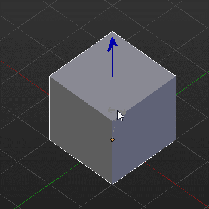
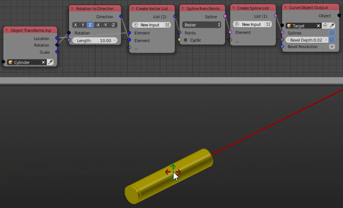

Rotation To Direction
=====================

Description
-----------
This node converts input rotation to a corresponding vector.

Demonstration
-------------
To better understand how this node works, you can think of it as follows: it gets you the local selected axis of the object.

In this example, you can see that the resultant vector is always aligned to the selected axis which is Z in this case.

Inputs
------

- **Rotation** - The rotation that defines the direction.
- **Length** - The magnitude of the resultant vector.

Outputs
-------

- **Direction** - The resultant vector.

Advanced Node Settings
----------------------

- N/A

Examples of Usage
-----------------

