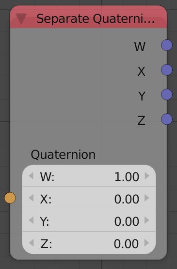
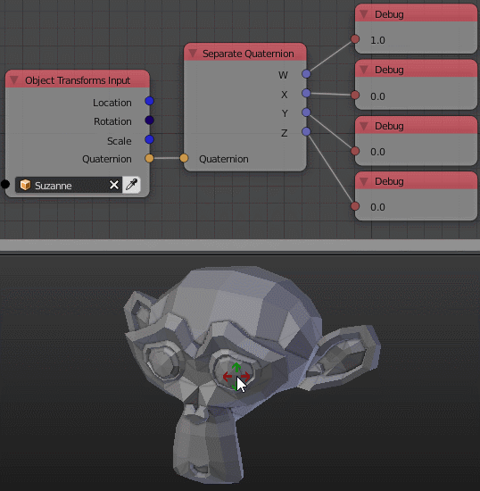

Separate Quaternion
===================

Description
-----------
This node takes a quaternion and returns its components.

Inputs
------

- **Quaternion** - A quaternion to decompose.

Outputs
-------

- **W** - The W component of the input quaternion.
- **X** - The X component of the input quaternion.
- **Y** - The Y component of the input quaternion.
- **Z** - The Z component of the input quaternion.

Advanced Node Settings
----------------------

N/A

Examples of Usage
-----------------

