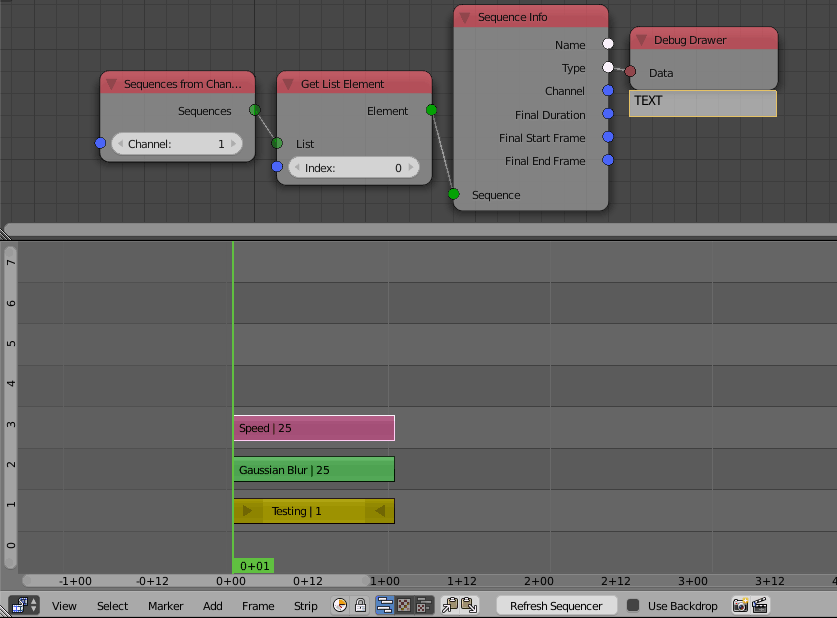

Sequences From Channel
======================

Description
-----------
This node returns all the sequence strips in the input *Channel*.

.. image:: images/sequences_from_channel_node.png
   :width: 160pt

Inputs
------

- **Channel** - The index of the channel to return its strips.
- **Scene** - A scene.

Outputs
-------

- **Sequences** - A list of sequences(strips) which are in the input channel.

Advanced Node Settings
----------------------

- N/A

Examples of Usage
-----------------

