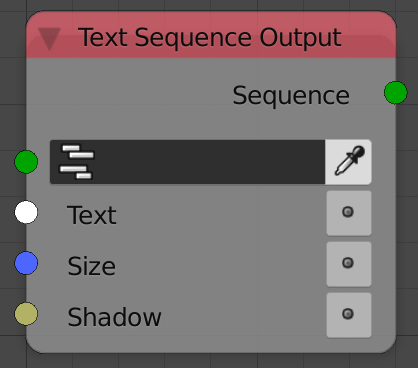

Text Sequence Output
====================

Description
-----------
This node writes date to a text sequence strip.

Inputs
------

- **Sequence** - A text strip to write data to.
- **Text** - A string to write.
- **Size** - The size of the text.
- **Shadow** - A boolean which if True will enable shadows for the text.
- **X Align** - A string that define the aligment horizontally. (See advanced node setting for possible values)
- **Y Align** - A string that define the aligment vertically. (See advanced node setting for possible values)
- **X Location** - The location of the text horizontally.
- **Y Location** - The location of the text vertically.
- **Wrap Width** - The maximum width a line is allowed to have.

Outputs
-------

- **Sequence** - The input text strip.

Advanced Node Settings
----------------------

- N/A

Examples of Usage
-----------------

.. image:: gifs/text_sequence_output_node_example.gif
