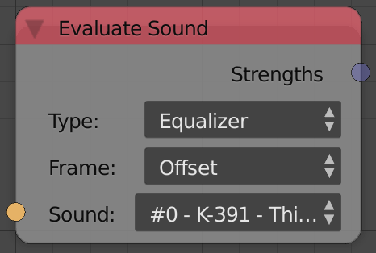
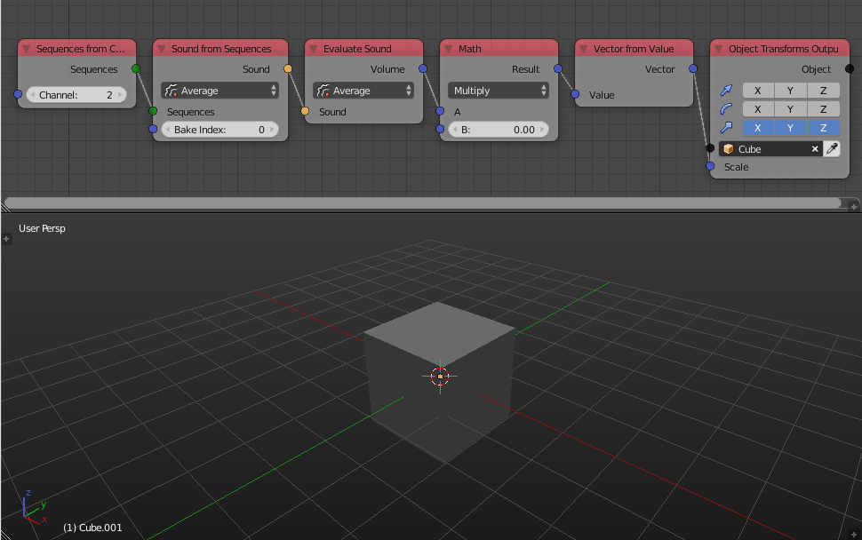

Evaluate Sound
==============

Description
-----------
This node returns the baked data---Ones that are baked using the sound bake node.

Options
-------

- **Type**:
	- **Single** - Returns a float that represent the intensity of the sound---Those that are baked using the Bake button and not the Bake Equalizer Data.
	- **Equalizer** - Returns a list of floats that represent the power of the frequencies---Those that were baked using the Bake Equalizer Data button.
- **Frame**:
	- **Offset** - The output intensities are evaluated at the current scene frame plus the input *Frame*.
	- **Absolute** - The output intensities are evaluated at the input *Frame*.

Inputs
------

- **Sound** - An input sound to evaluate.
- **Frame** - The frame at which the sound is evaluated.In case of the *Offset*, it act as an offset for the current frame. In case of the *Absolute*, it act as the frame at which the sound is evaluated.

Outputs
-------

- **Stength** - The intensity of the sound at the current frame. (Only output in *Single*)
- **Stengths** - A float list that contain the intensities of the *Equalizer Data*. (Only output in *Equalizer*)

Advanced Node Settings
----------------------

- **Sync Mode** - The synchronization mode between the playback and the audio file.

Examples of Usage
-----------------

