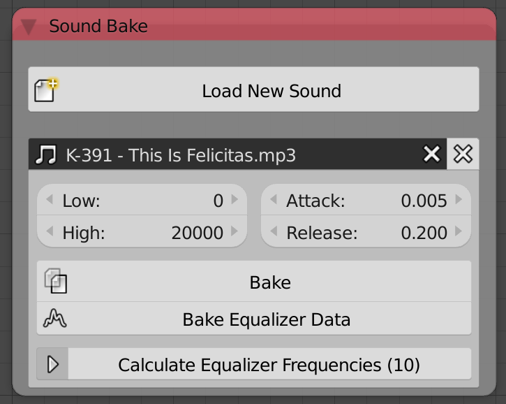

Sound Bake
==========

Description
-----------
This node let you decode,bake and cache a sound file.

Options
-------

- **Low** - The lowest frequency to include.
- **High** - The highest frequency to include.
- **Attack** - The speed at which the sound reach maximum intensity(gain intensity). *Study ADSR concept*
- **Release** - The speed at which the sound lose intensity. *Study ADSR concept*
- **Bake** - By pressing that button, you calculated and cached the sound intensity at each frame.
- **Bake Equalizer Data** - By pressing that button, you calculated and cached the intensity of multiple frequencies at each frame.
- **Calculate Equalizer Data** - By pressing that button, you get a pop up to define automatically the frequencies at which the equalizer data is calculated, and it got some options:
	- **Amount** - The number of frequencies to compute.
	- **Start** - The lowest frequency to include.
	- **End** - The highest frequency to include.
	- **Base** - The base of the exponential function which the frequencies positions are define by. (This avoid bad distribution of frequencies by using a logarithmic scale.)
	- **Exponent** - The exponent of the exponential function which the frequencies positions are defined by. (Input Zero if you want a linear definition of the frequencies.)

Inputs
------

- N/A

Outputs
-------

- N/A

Advanced Node Settings
----------------------

- N/A
