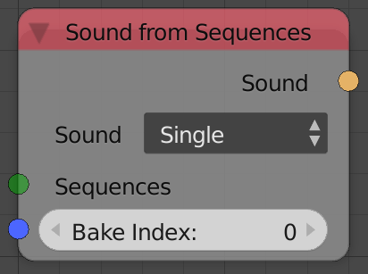

Sound From Sequences
====================

Description
-----------
When sound are baked using the *Sound bake* node, they are in fact added to the sequence editor at a certain channel, and you can select a sound by its location in the sequencer channels.

Options
-------

- **Sound Type**:
	- **Single** - Returns the sound which was baked using the **Bake** button.
	- **Equalizer** - Returns the sound which was baked using the **Bake Equalizer Data** button.

Inputs
------

- **Sequences** - The sequences at which the sound strips exist, you can get sequences list by using the *Sequences From Channel* node.
- **Bake Index** - The index of the baked data. Multiple equalizer data can be baked using the *Sound Bake* node and this index let you choose which one to get.

Outputs
-------

- **Sound** - The sound data of the sound strip.

Advanced Node Settings
----------------------

- N/A

Examples of Usage
-----------------

.. image:: gifs/evaluate_sound_node_example.gif
