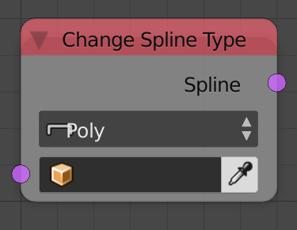

Change Spline Type
==================

Description
-----------

This node change the type of the input spline to either bezier or poly spline.

Options
-------

- **Poly** - Will change the spline into a poly spline.
- **Bezier** - Will change the spline into a bezier spline.

Inputs
------

- **Spline** - A spline(s) to convert.

Outputs
-------

- **Splines** - The converted splines.

Advanced Node Settings
----------------------

- N/A

Examples of Usage
-----------------

.. image:: gifs/change_spline_type_node_example.gif
