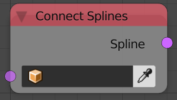
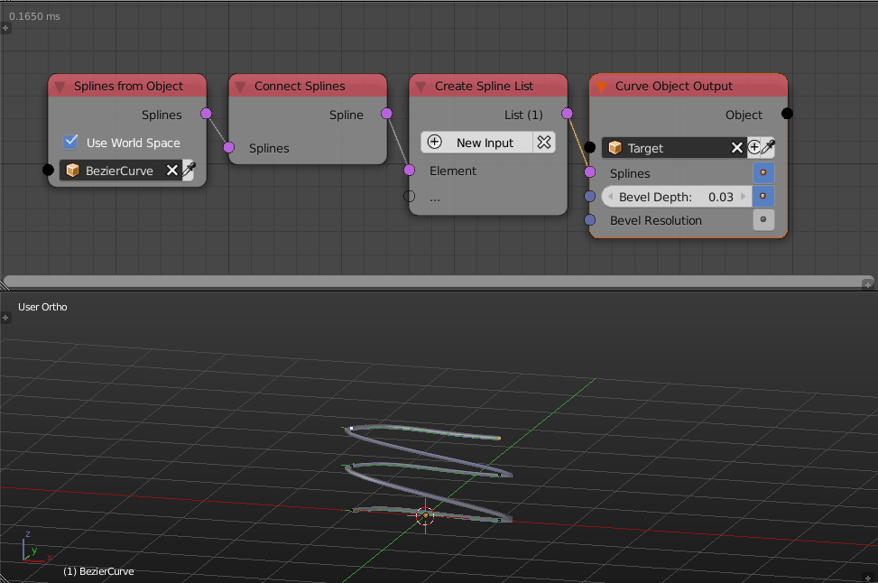

Connect Splines
===============

Description
-----------
This node connects all the input splines, that is, the ending point of each spline will be connected to the starting point of the following spline---The following spline in the splines list.

Inputs
------

- **Splines** - A list of splines to connect.

Outputs
-------

- **Spline** - The connected spline.

Advanced Node Settings
----------------------

- N/A

Examples of Usage
-----------------

