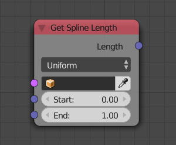
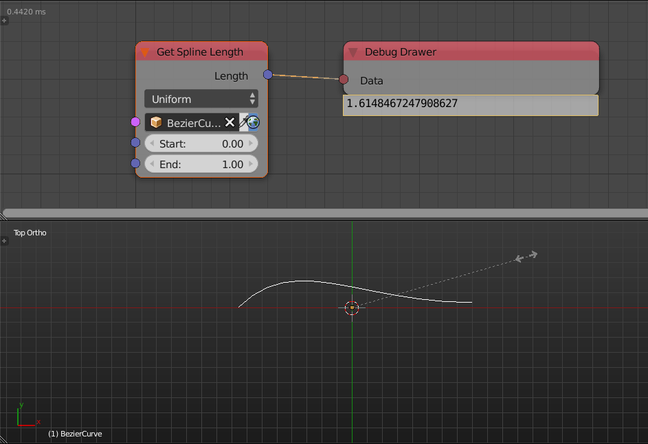

Get Spline Length
=================

Description
-----------

This node returns the length of the input spline, it can be restricted to a defined interval.

.. include:: /includes/nodes/uniform_vs_resolution.rst

In this node, those options only matter when an interval is defined since the interpolation method is only used to define the interval and not to get the length.

Inputs
------

- **Spline** - A spline.
- **Start** - The start of the interval.
- **End** - The end of the interval.

Outputs
-------

- **Length** - The length of the spline in the defined interval.

Advanced Node Settings
----------------------

- **Resolution** - It is the quality of the spline used to do the calculation, in other words, it is the number of handles in the spline which is used in sampling the interval.

Examples of Usage
-----------------

