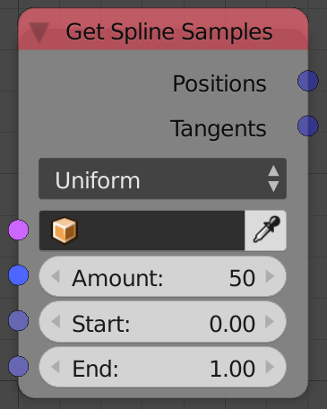
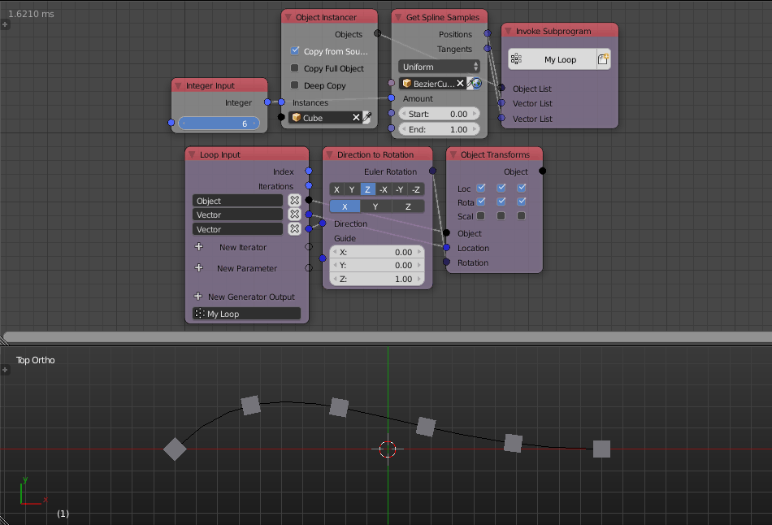

Get Spline Samples
==================

Description
-----------
This node will return `n` number of points along with their tangent vectors where `n` is the **Amount** input, Those points are points on the spline in the input interval that are distributed based on the evaluation option---Uniform or Resolution.

.. include:: /includes/nodes/uniform_vs_resolution.rst

Inputs
------

- **Spline** - A spline to evaluate.
- **Amount** - The amount of point to return.
- **Start** - The starting point of the interval.
- **End** - The ending point of the interval.

Outputs
-------

- **Positions** - A vector list that contain the evaluated points positions.
- **Tangent** - A vector list that contain vectors that are aligned with the tangent line to the evaluated points.

Advanced Node Settings
----------------------

- **Resolution** - It is the quality of the evaluated spline, in other words, it is the number of handles in the spline used in evaluation.

Examples of Usage
-----------------

