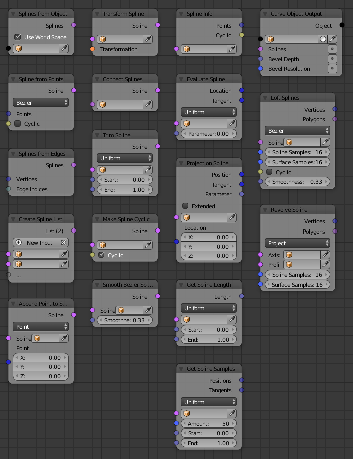

Spline
======

.. toctree::
    Get from Object <get_from_object>
    Create from Points <create_from_points>
    Create from Edges <create_from_edges>
    List <list>
    Append Point <append_point>
    Transform <transform>
    Connect <connect>
    Trim <trim>
    Make Cyclic <make_cyclic>
    Smooth Bezier <smooth_bezier>
    Info <info>
    Evaluate <evaluate>
    Project <project>
    Get Length <get_length>
    Get Samples <get_samples>
    Object Output <curve_object_output>
    Loft <loft>
    Revolve <revolve>

