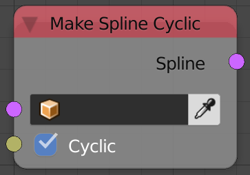
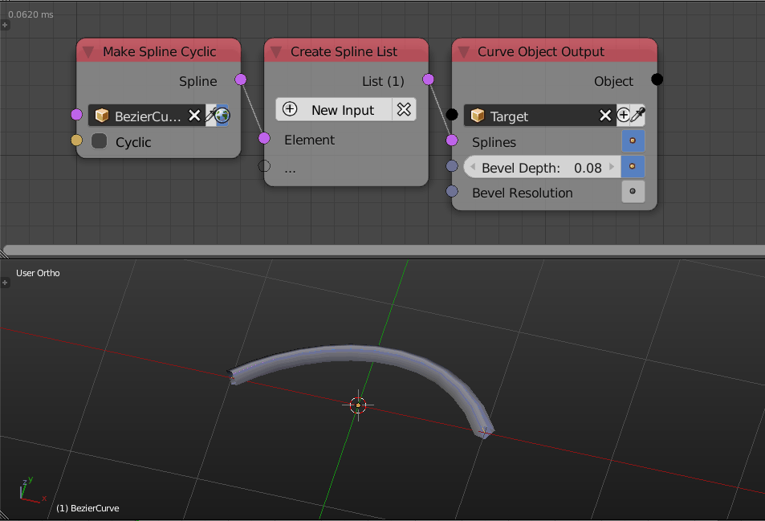

Make Spline Cyclic
==================

Description
-----------
This node will connect or disconnect the first and the last handle of the input spline.

   
Inputs
------
 
- **Spline** - A spline.
- **Cyclic** - A boolean which if true will connect the first and the last handle of the input spline together, if fasle will disconnect them.

Outputs
-------

- **Spline** - The output spline.

Advanced Node Settings
----------------------

- N/A

Examples of Usage
-----------------

