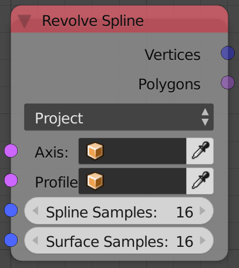
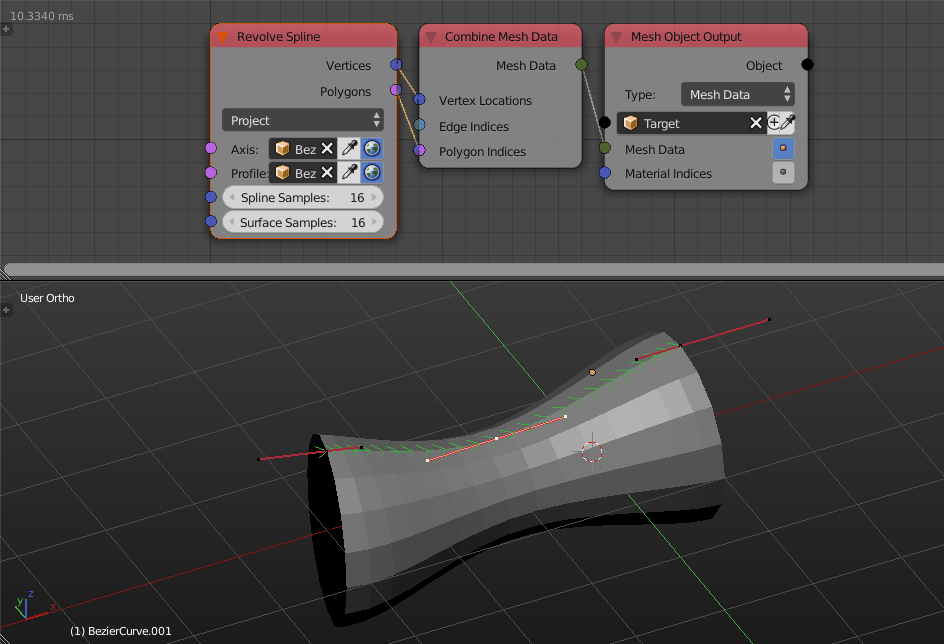

Revolve Splines
===============

Description
-----------
This node creates a mesh from the input splines by revolving the profile spline around the axis spline.

Options
-------

- **Project** - This option will sample some points from the profile spline, project them on the axis spline and then revolve each point around its projection.This method output a nicer result especially if the axis and profile splines are different in length but it is much slower due to the projection process.
- **Same Parameter** - This option will sample some point from both the profile and the axis splines and revolve each point around its corresponding point. This method have difficulties especially if the axis and the profile splines are different in length since corresponding points will be far from each other and thus resulting distortion however this method is genrally much faster than the Project method.

Illustration
------------

.. image:: images/revolve_spline_node_illustration.png

Inputs
------

- **Axis** - A spline that is used as the source of pivots for the revolving.
- **Profile** - A spline in which spline samples are originated for revolving.
- **Spline Samples** - The number of points sampled for revolving.
- **Surface Splines** - The number of points sampled during revolving.

Outputs
-------

- **Vertices** - A vector list that contains the vertices locations of the output mesh.
- **Polygons** - A polygon indices list that carries the polygons information of the output mesh.

Advanced Node Settings
----------------------

- N/A

Examples of Usage
-----------------

