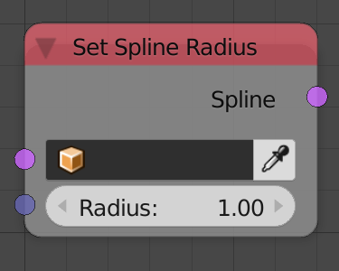
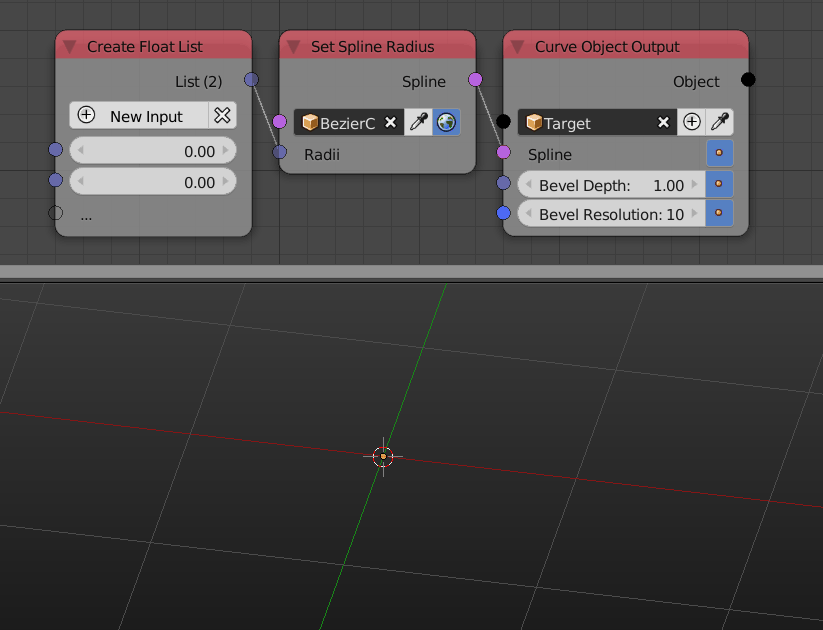

Set Spline Radius
=================

Description
-----------

This node set the radius of individual spline points.

Inputs
------

- **Splines** - A spline(s) to set their radius.
- **Radius** - A float list that include the radii of each point in the input spline. (Has to has a length equal to the amount of points the spline(s) has)

Outputs
-------

- **Spline** - The output splines.

Advanced Node Settings
----------------------

- N/A

Examples of Usage
-----------------

