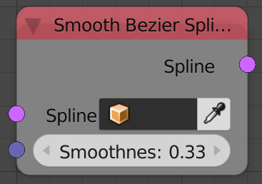
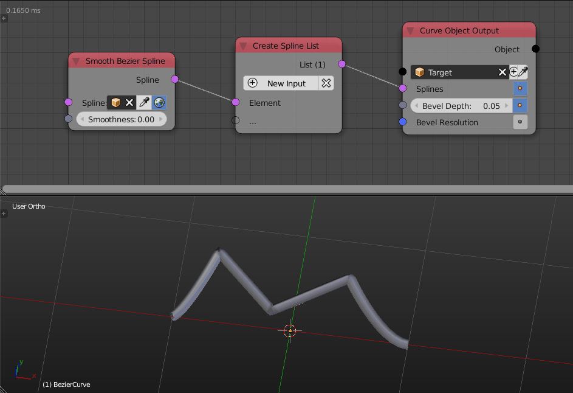

Smooth Bezier Spline
====================

Description
-----------
This node will edit the handles of the input spline so that the spline get smoothed.
In fact, the node just set the length of the handles to the **smoothness** value and align them to the tangent line to the curve at their location.So if the smoothnes value is set to zero, the bezier will act as a poly spline since it has no handles.

Note that this only work for bezier splines and not poly splines.

   
Inputs
------
 
- **Spline** - A spline.
- **Smoothness** - A float that define the amount of smoothness. (the length of the handles of the bezier spline)

Outputs
-------

- **Spline** - The smoothed spline.

Advanced Node Settings
----------------------

- N/A

Examples of Usage
-----------------

