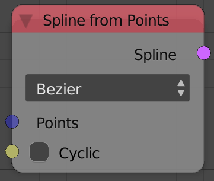
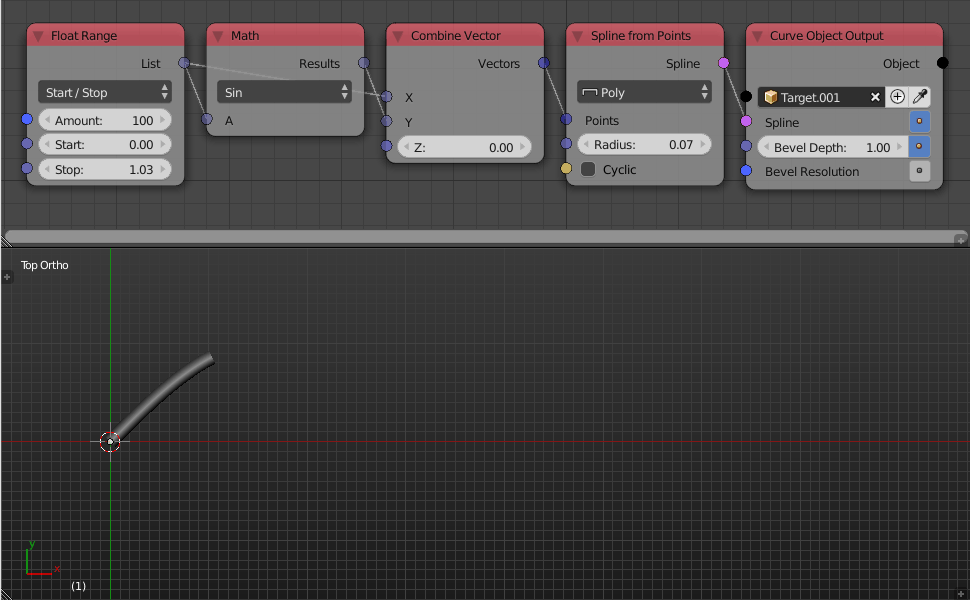

Spline From Points
==================

Description
-----------
This node creates a new spline from input vectors, each vector will represent the position of a handle in the output spline.

Options
-------

- **Bezier** - This option will create the spline as a bezier spline, a bezier spline can then be smoothed after creation and even have its handles manually edited.
- **Poly** - This option will create the spline as a simple poly spline, a poly spline is just a linear connection between points and can't be smoothed or edited but it is faster to create.

Inputs
------

- **Points** - A vector list that represents the position of the handles of the output splines.
- **Cyclic** - A boolean which if True will connect the first handle to the last handle and thus having a closed spline.

Outputs
-------

- **Spline** - The output spline.

Advanced Node Settings
----------------------

- N/A

Examples of Usage
-----------------

