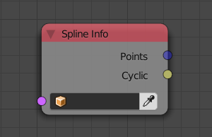
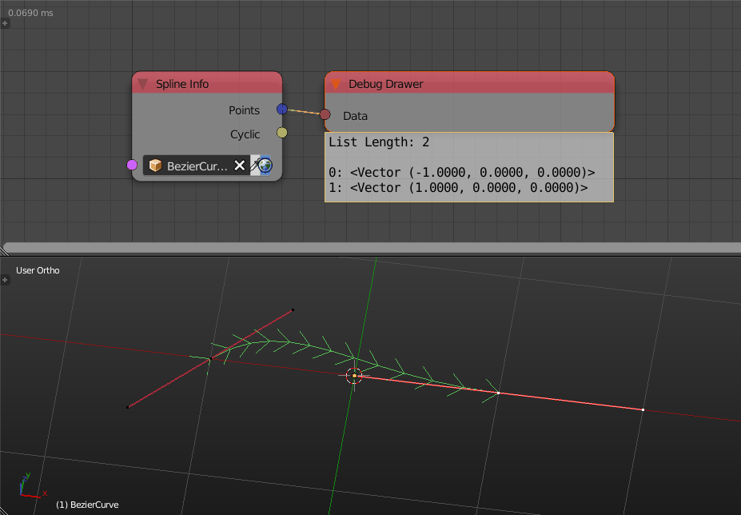

Spline Info
===========

Description
-----------
This node returns some information about the input spline as the location of its handles and whether the spline is closed, that is, every handle is connected to two other handles.

Inputs
------

- **Spline** - A spline.

Outputs
-------

- **Spline** - A vector list that contain the locations of the handles of the input spline.
- **Cyclic** - A boolean that is true if the spline is closed, that is, every handle is connected to two other handles.

Advanced Node Settings
----------------------

- N/A

Examples of Usage
-----------------

