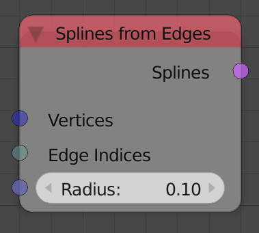
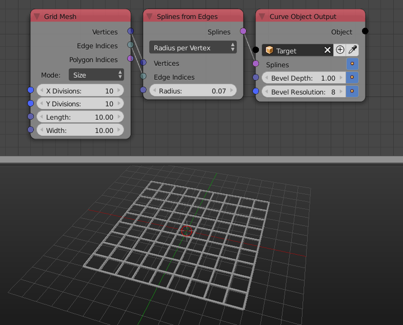

Spline From edges
=================

Description
-----------

This node creates a linear poly spline for every input edge, that is, every edge will represent a linear poly spline that have 2 point which are the vertices of the edge.

Options
-------

- **Radius Per Vertex** - This options sets the radius per vertex, so the node expects a radius list with the same length as the the vertices list.
- **Radius Per Edge** - This options sets the radius per edge, so the node expects a radius list with the same length as the the edge indices list.

Inputs
------

- **Vertices** - A vector list that represent the position of the vertices of the edges.
- **Edge Indices** - An Edge Indices list.
- **Radius(radii)** - The radius of the splines or a list of radii of the splines based on the selected option.

Outputs
-------

- **Splines** - The output splines.

Advanced Node Settings
----------------------

- N/A

Examples of Usage
-----------------

