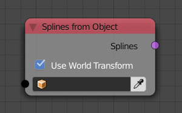
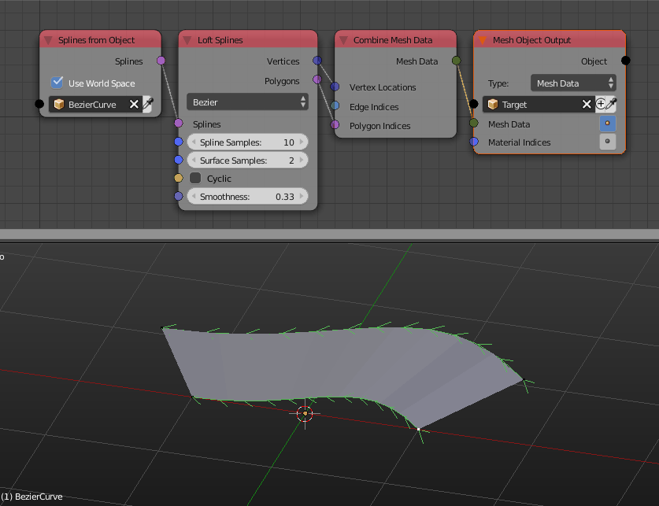

Splines From Object
===================

Description
-----------
This node return the spline(s) of the input curve.

A spline is the data that form curves, a curve is composed of a single or multiple splines.

The node has an option to return the splines in the world space or in local space coordinates.

Inputs
------

- **Object** - A curve to return it's splines.

Outputs
-------

- **Splines** - A list of splines that has all the splines in the input curve.

Advanced Node Settings
----------------------

- **Import Type** - This option is set to **all** by default which return all the splines in the input curve. The other option **Single** will add an extra input **Index** which will be the index of the output spline and of course the output will be a single spline and not a list of splines.

Examples of Usage
-----------------

