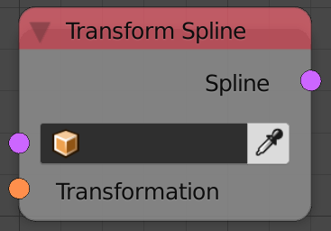
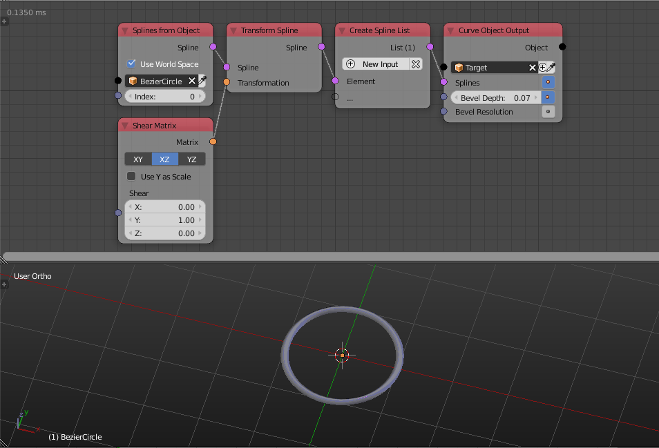

Transform Spline
================

Description
-----------
This node transform the input spline based on the input transformation matrix.

Inputs
------

- **Spline** - A spline to transform.
- **Transformation** - A transformation matrix.

Outputs
-------

- **Spline** - The transformed spline.

Advanced Node Settings
----------------------

- N/A

Examples of Usage
-----------------

