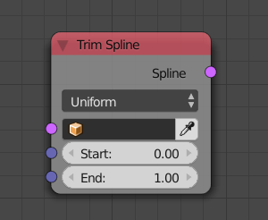

Trim Spline
===========

Description
-----------

This node will trim (cut) the input spline to a specific normalized interval.

.. include:: /includes/nodes/uniform_vs_resolution.rst

Inputs
------

- **Spline** - A spline to trim.
- **Start** - The start of the interval.
- **End** - The end of the interval.

Outputs
-------

- **Spline** - The trimed spline.

Advanced Node Settings
----------------------

- **Resolution** - It is the quality of the resulted spline, in other words, it is the number of points in the output spline.

Examples of Usage
-----------------

.. image:: gifs/trim_spline_node_example.gif
