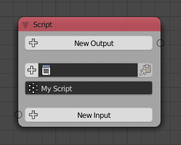

Script
======

.. include:: /includes/workinprogress.rst
.. todo:: unfinished content in file user_guide/nodes/subprograms/script.rst

Begin by adding a script node, and connecting the script node to a text datablock, created with the Blender text editor. To add input or output variables, use the New Input and New Ouput buttons on the node UI. The input and output names are automatically mapped to global variables in your script. Once input and output variables are configured, you can invoke your script by finding its name under Subprograms-InvokeSubprogram. Here is an example of a very simple script.

.. image:: images/script_ex1.jpg

Importing Animation Nodes Datatypes
-----------------------------------

When importing Animation Nodes datatypes into script, the animation_nodes module is already imported into the namespace. Because AN can sometimes be installed to different locations. The safest way to import datatypes is with statements like this::

    PolySpline = animation_nodes.data_structures.splines.poly_spline.PolySpline

However, this line will fail if you click "Run Script" inside a Blender text editor, because in that case the AN script environment is not setup. If you wish to be able to click on "Run Script", for example to text syntax. Then you can include the following lines to conditionally setup the animation_nodes module reference in case it is missing.::

    import sys
    if "animation_nodes" not in globals():
        global animation_nodes
        animation_nodes = sys.modules["animation_nodes-master"]
