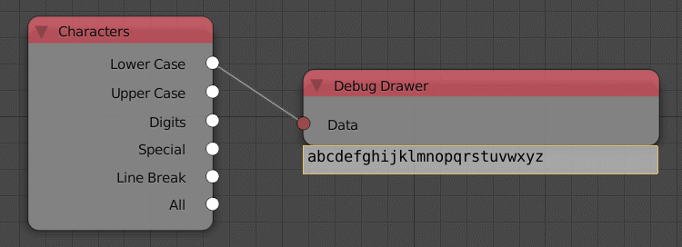

Characters
==========

Description
-----------

This node returns a string that contains all the characters in a specific category including:

- **Lower Case**
- **Upper Case**
- **Digits**
- **Special**
- **Line Break**
- **All**

.. image:: images/characters_node.png
   :width: 160pt

Inputs
------

- N/A

Outputs
-------

- **Lower Case** - All lower case characters.
- **Upper Case** - All upper case characters.
- **Digits** - All the digits.
- **Special** - All special characters like (:,?").
- **Line Break** - Include a new line.
- **All** - All of the previous category.

Advanced Node Settings
----------------------

- N/A

Examples of Usage
-----------------

