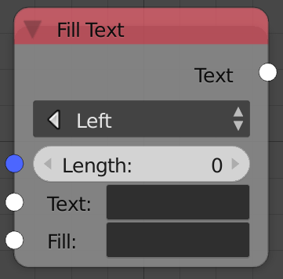
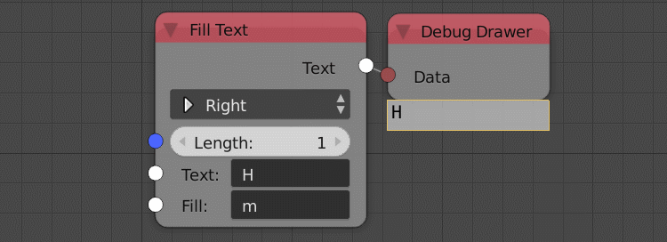

Fill Text
=========

Description
-----------
This node fills the empty characters by a string based on a defined number of characters.

Suppose you have the string "AN", if you defined the length as "5" then you have
"AN   " (notice the 3 empty spaces).Then those empty spaces will be filled by the
input string **fill**. If the fill is set to ha then the output will be "ANhahaha".

Inputs
------

- **Length** - The amount of characters in the reference string.
- **Text** - The input text.
- **Fill** - The string used in filling.

Outputs
-------

- **Text** - The output string.

Advanced Node Settings
----------------------

- N/A

Examples of Usage
-----------------

