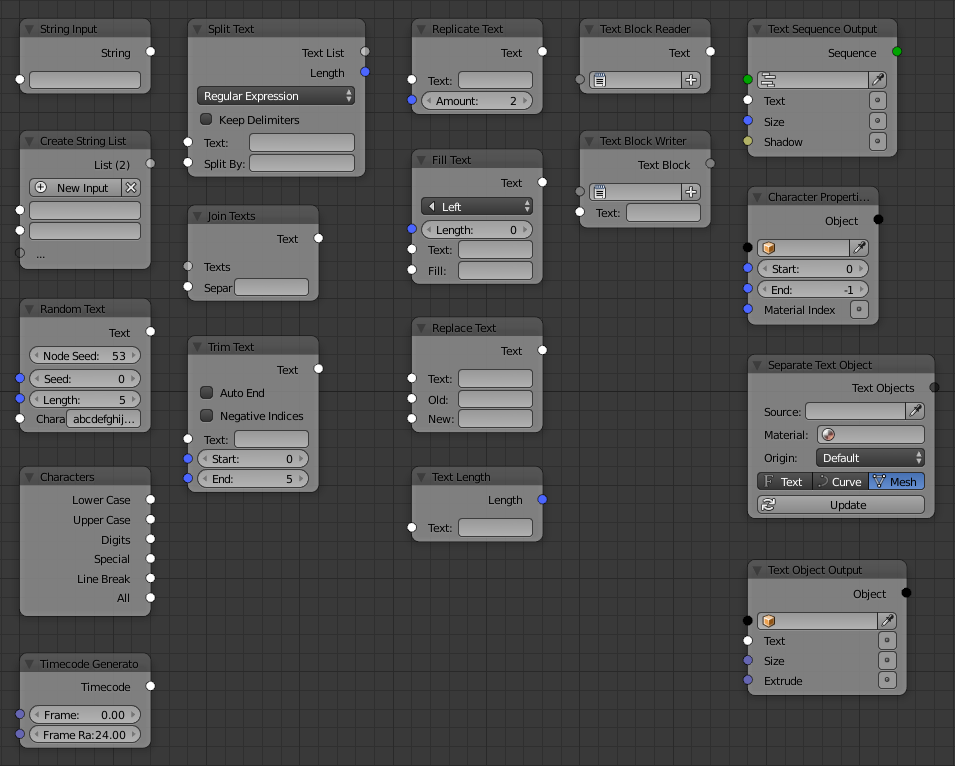

Text
====

.. toctree::   
   Input <input>
   List <list>
   Randomize <randomize>
   Characters <characters>
   Split <split>
   Join <join>
   Trim <trim>
   Replicate <replicate>
   Fill <fill>
   Replace <replace>
   Length <length>
   Block Reader <block_reader>
   Block Writer <block_writer>
   Sequence Output <sequence_output>
   Character Property <character_property>
   Object Separate <object_separate>
   Object Output <object_output>

