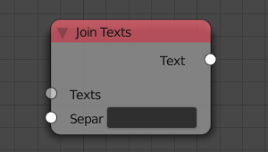
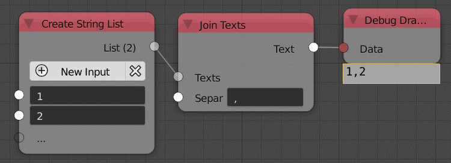

Join Text
=========

Description
-----------

This node joins a list of strings in a single string.

Inputs
------

- **Texts** - A list of strings to join.
- **Separator** - An option to add a string between every string when joining them.

Outputs
-------

- **Text** - The output string.

Advanced Node Settings
----------------------

- N/A

Examples of Usage
-----------------

