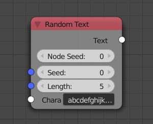

Randomize
===========

**Seed:** Change the seed to get another random text.

**Length:** How many letters the random text has.

**Characters:** Source letters. The random text is generated from these. The Characters node can be helpful to get other letters.
