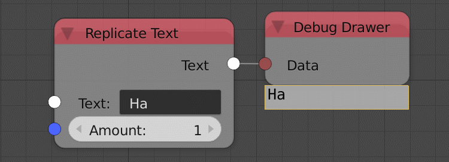

Replicate Text
==============

Description
-----------
This node is used to repeat the input text.

.. image:: images/replicate_text_node.png
   :width: 160pt

Inputs
------

- **Text** - An input text to replicate.
- **Amount** - The amount of replication.

Outputs
-------

- **Text** - The output string.

Advanced Node Settings
----------------------

- N/A

Examples of Usage
-----------------

