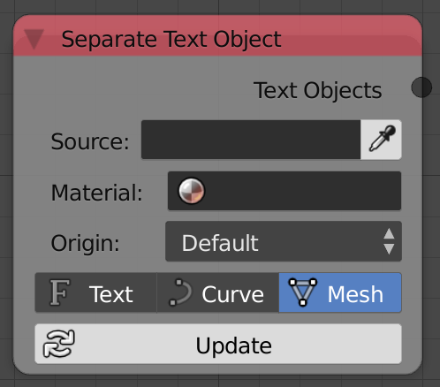
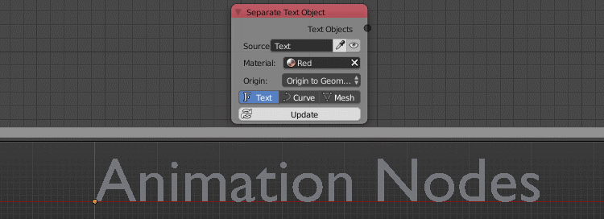

Separate Text Object
====================

Description
-----------

This node takes a text object and separates its characters into individual objects.

Options
-------

- **Type** - Lets you choose the type of the output object, it can be Text, Curve or a Mesh.

Inputs
------

- **Source** - The source text object.
- **Material** - A material to assign to the newly created objects.
- **Origin** - The location of the object's origin.
- **Type** - The type of the newly created object. (Text,Curve,Mesh)

Outputs
-------

- **Text Objects** - A list that contains the newly created objects.

Advanced Node Settings
----------------------

- **Parent To Main Container** - Parent the objects to Animation Nodes' container.

Examples of Usage
-----------------

