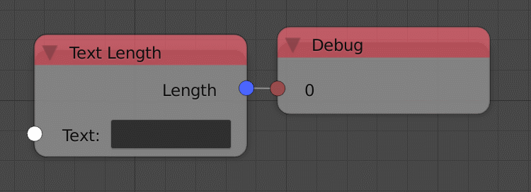

Text Length
===========

Description
-----------

This node will return the number of characters in the input text.

.. image:: images/text_length_node.png
   :width: 160pt

Inputs
------

- **Text** - The input string.

Outputs
-------

- **Length** - The number of characters in the input text.

Advanced Node Settings
----------------------

- N/A

Examples of Usage
-----------------

