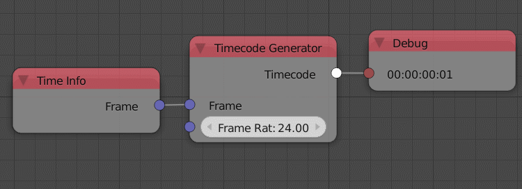

Timecode Generator
==================

Description
-----------

This node returns the current time (based on input frame and a given frame rate) in miliseconds, seconds, minutes and hours separated by a colon.

.. image:: images/timecode_generator_node.png
   :width: 160pt

Inputs
------

- **Frame** - The current frame.
- **Frame Rate** - The number of frames per seconds (FPS) of the scene.

Outputs
-------

- **Timecode** - The output string.

Advanced Node Settings
----------------------

- N/A

Examples of Usage
-----------------

