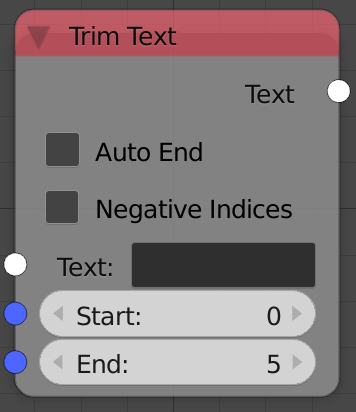
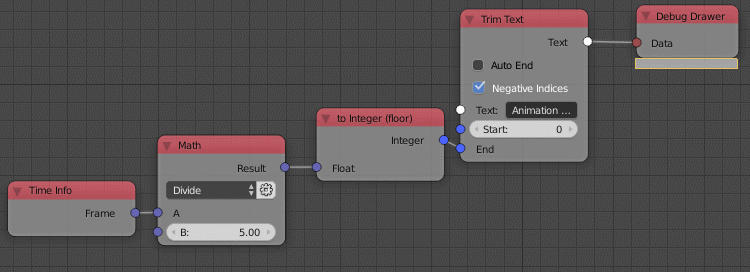

Trim Text
=========

Description
-----------

This node aloows you to cut a number of characters from the input string either
from start of from the end.

A string is a list of characters and each characters has an index starting from
1 (not be confused with how python represents them, Animation nodes uses 1 for
better UX). So the character "A" in string "Animation nodes" has an index of "1"
and the character "m" has an index of "3".

This node will return the string that start at index **Start** and end at the
index **End**. So if I set the start index to be 0 and the end index to be 5
the output will be "Anima".

Assuming you only want to cut the first couple of characters, the node offers an
option to set the end index to be the last character in the input string, that
way you can just edit the start index and cut the amount of characters you want.

The node also has an option to enable negative indicies. When you enter
negative indicies as a start or end index andimation nodes start counting from
the other end or in other words the last character.This will allow you to flip
the cutting from one end to another.

Inputs
------

- **Text** - An input text to trim.
- **Start** - The start index.(integer)
- **End** - The end index.(integer)

Outputs
-------

- **Text** - The output string.

Advanced Node Settings
----------------------

- N/A

Examples of Usage
-----------------

