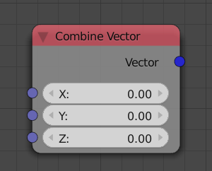
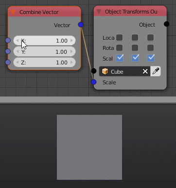

Combine Vector
==============

Description
-----------
This node compose a 3D vector from X,Y,Z components.

Inputs
------

- **X** - The X component of the output vector.
- **Y** - The Y component of the output vector.
- **Z** - The Z component of the output vector.

Outputs
-------

- **Vector** - A vector composed of inputs X,Y,Z .

Advanced Node Settings
----------------------

N/A

Examples of Usage
-----------------

