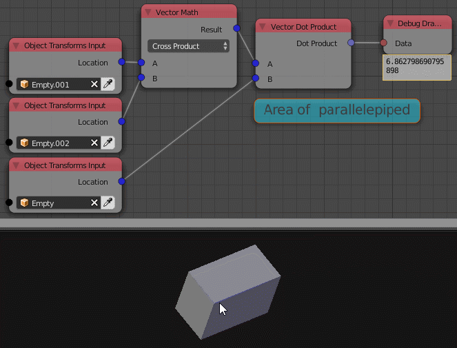

Dot Product
===========

Description
-----------

This node calculates the dot product of the 2 input vectors.

.. image:: images/dot_product_node.png
   :width: 160pt

Inputs
------

- **Vector A** - The first vector.
- **Vector B** - The second vector.

Outputs
-------

- **Dot Product** - The dot product of the 2 input vectors.

Advanced Node Settings
----------------------

- N/A

Examples of Usage
-----------------

