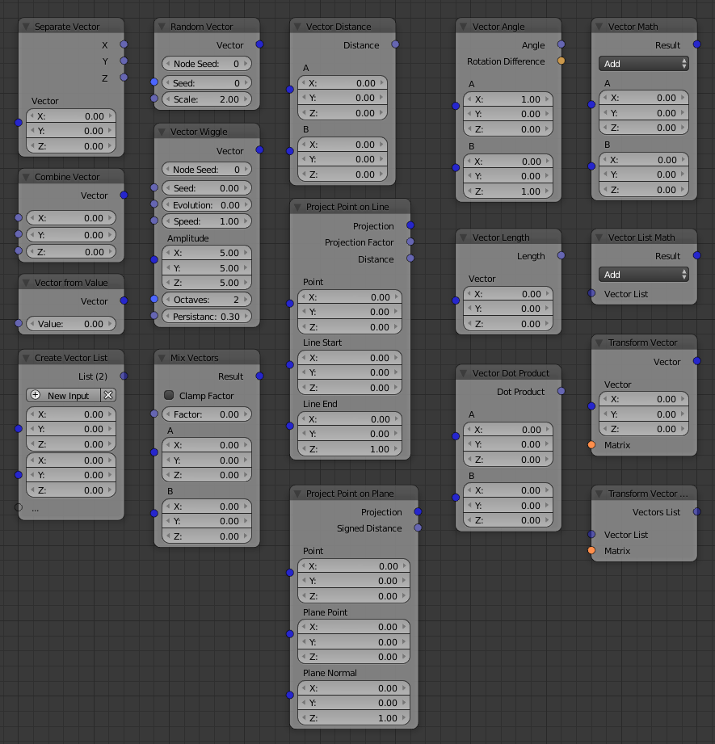

Vector
======

.. toctree::
   Separate <separate>
   Combine <combine>
   From Value <from_value>
   List <list>
   Randomizse <randomize>
   Wiggle <wiggle>
   Mix <mix>
   Length <length>
   Distance <distance>
   Math <math>
   Transform Vector <transform_vector>
   Transform Vector List <transform_vector_list>

