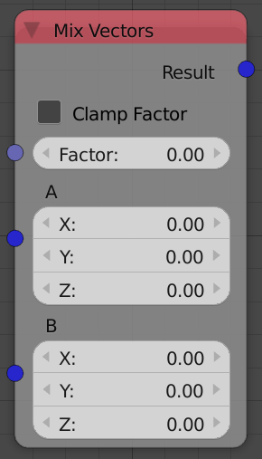
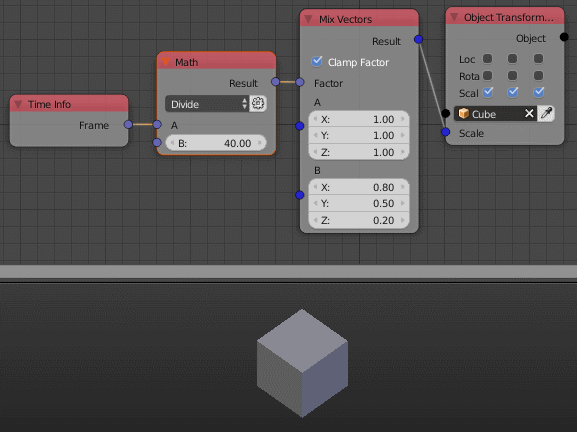

Mix Vectors
===========

Description
-----------
This node mix between 2 vectors by a defined factor.

Inputs
------

- **Factor** - A float that control the amount of each vector input to the output, Where 0 means the first vector only and 1 means the second vector only.

Outputs
-------

- **Result** - The result vector of mixing the two vectors by the input factor.

Advanced Node Settings
----------------------

- N/A

Note
----

By how the *Mix Vectors* works, A factor that is larger than 1 won't be clamped but rather multiplied to the second float, That's why the node has an option to *Clamp Factor*. So if *Clamp factor* is enables, Any factor that is larger than 1 will resturn the second vector.

Examples of Usage
-----------------

