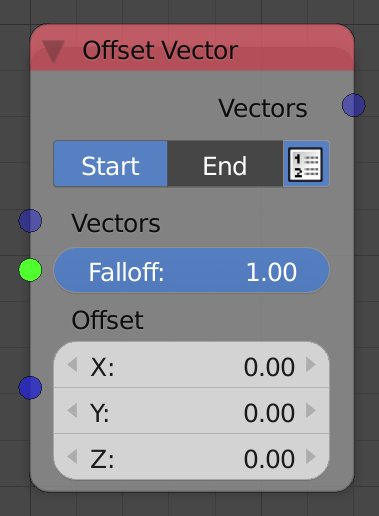
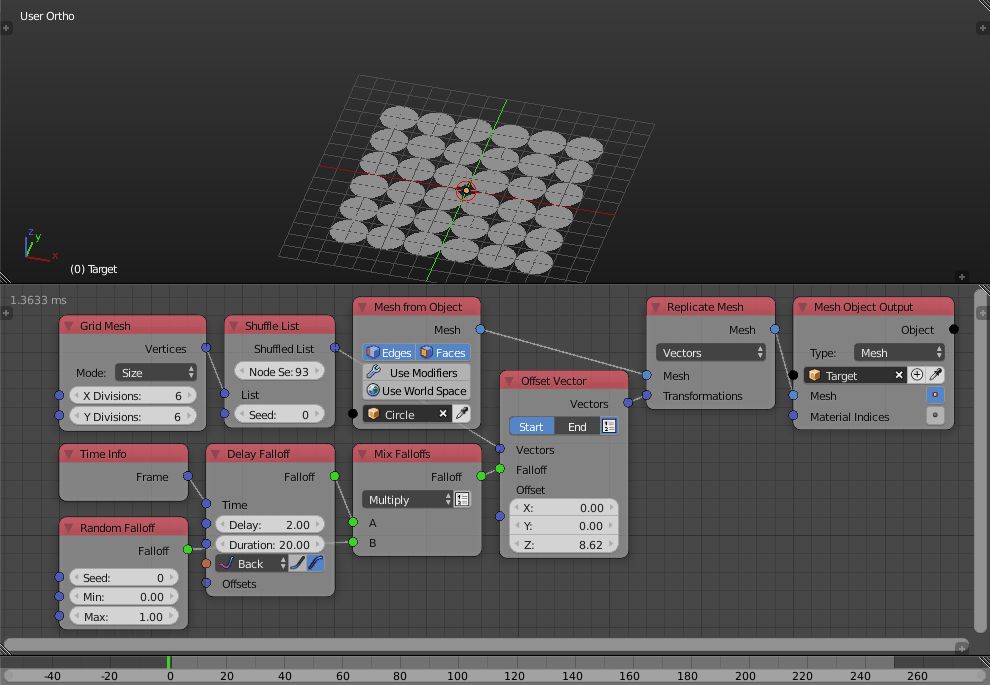
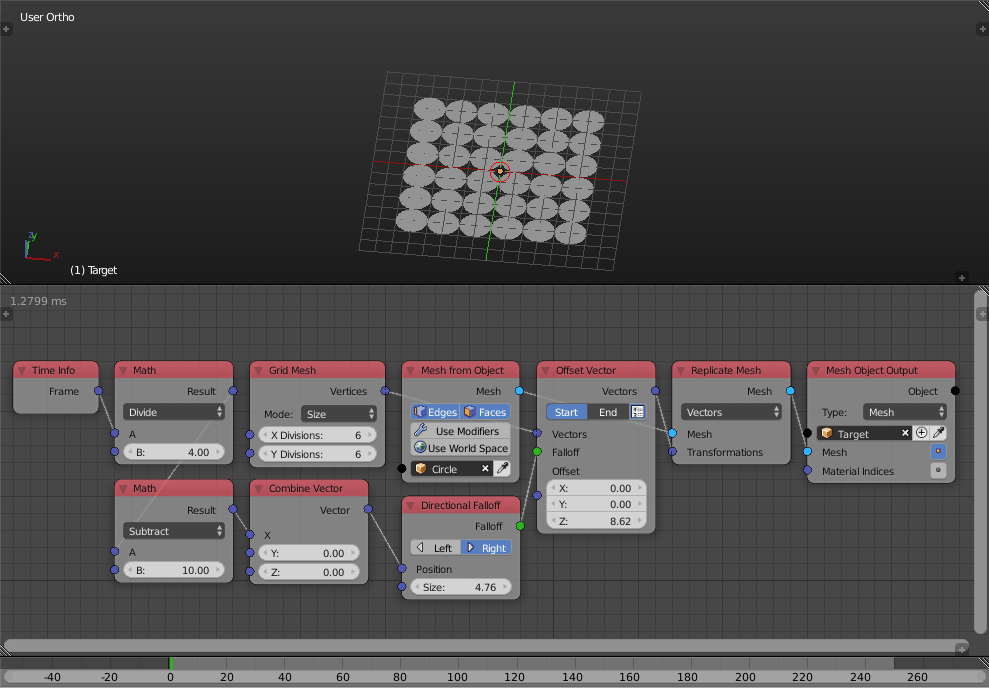
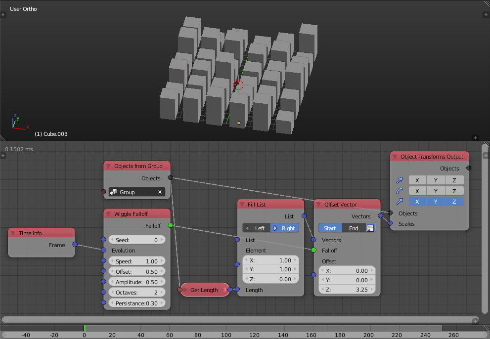

Offset Vector
=============

Description
-----------

This node offset the input vector(s) based on an input offset vector with an input falloff as a factor. It is a linear interpolation between the input vector(s) and the input vector(s) plus the offset vector where the factor of the interpolation is the falloff value.

Options
-------

- **Start/End** - *Start* will return the input vectors when the falloff is minimum (zero) and the input vectors plus the offset vector when the falloff is maximum (one). *End* on the other hand will return the input vectors plus the offset vector when the falloff is minimum (zero) and the input vectors when the falloff is maximum (one).
- **Use Vector List** - It is the button you see beside the *Start/End* options, if is enabled, the node will expect a vector list to offset and the output will be the offset vector list.

Inputs
------

- **Vector(s)** - A vector(s) to offset.
- **Falloff** - A falloff to use as a factor.
- **Offset** - The offset vector.

Outputs
-------

- **Vector(s)** - The resulted vector(s).

Advanced Node Settings
----------------------

- N/A

Examples of Usage
-----------------

If *End* is used instead of *Start*, the animation reverse:

