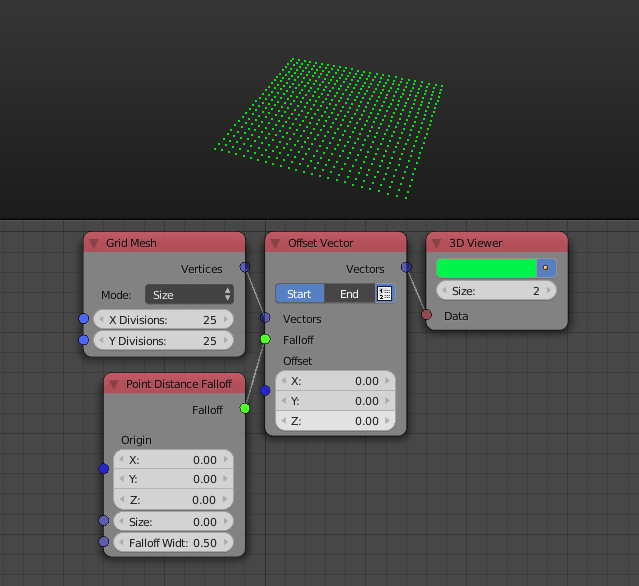

Offset Vector
=============

Description
-----------

This node offset a vector based on an input offset vector with an input falloff as a factor.

.. image:: images/offset_vector_node.png
   :width: 160pt

Options
-------

- **Start/End** - Start will offset the vectors based on the offset vector with the falloff as a factor. End will offset the vectors based on the offset vector with the inverse falloff as a factor, in other words, all points will be transformed based on the offset vector and then points will be transformed back to their initial position based on the offset vector with the falloff as a factor.
- **Use Vector List** - It is the button you see beside the *Start/End* options, if is enabled, the node will expect a vector list to offset and the output will be the offset vector list.

Inputs
------

- **Vector(s)** - A vector(s) to offset.
- **Falloff** - A falloff to use as a factor.
- **Offset** - The offset vector.

Outputs
-------

- **Vector** - The new coordinates of the point after offset.

Advanced Node Settings
----------------------

- N/A

Examples of Usage
-----------------

