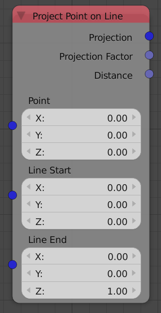
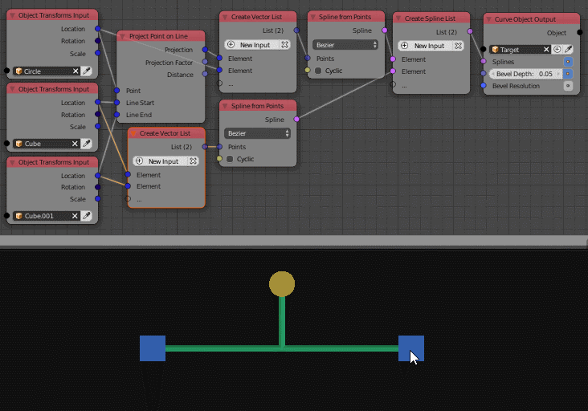

Project Point On Line
=====================

Description
-----------
This node takes a defined point and a defined line and returns information about the projection of this point on that line such as:

 - The closest point on the line.
 - The shortest distance between the point and line.
 -  The ratio between the length of the input line and a the length of the line formed by the projected point and the input line starting point.

Inputs
------

- **Point** - The coordinates of the point that will be projected.
- **Line Start** - The coordinates of the line starting point.
- **Line End** - The coordinates of the line ending point.

Outputs
-------

- **Projection** - The coordinates of the closest point on the line to the input point. Mathematically this point is the point that makes a perpendicular line to the input line.
- **Projection Factor** - It is the ratio between the length of the line formed by the projected point and the input line's first point and the length of the input line.
- **Distance** - It is the shortest distance between the input point and the input line, Which is also the distance between the projected point and the input point.

Advanced Node Settings
----------------------

- N/A

Examples of Usage
-----------------

