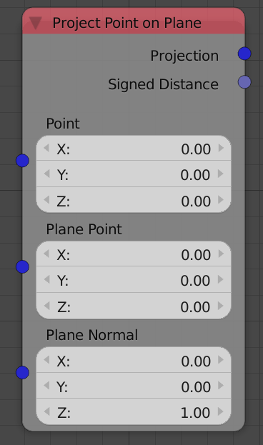
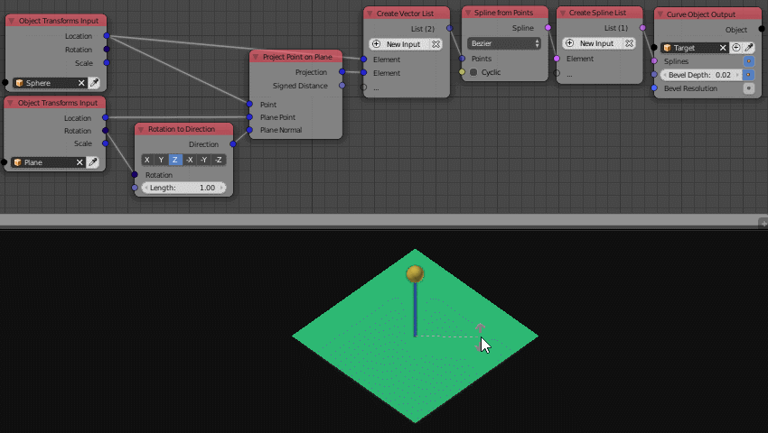

Project Point On plane
======================

Description
-----------
This node takes a defined point and a defined plane and returns information about the projection of this point on that plane such as:

 - The closest point on the plane.
 - The shortest distance between the point and plane.

Inputs
------

- **Point** - The coordinates of the point that will be projected.
- **Plane Point** - The location or the origin of the plane.
- **Plane Normal** - The direction the plane is pointing.

Outputs
-------

- **Projection** - The coordinates of the closest point on the plane to the input point. Mathematically this point is the point that makes a perpendicular line to the input plane which also makes a line that is parallel to the plane normal.
- **Signed Distance** - It is the shortest distance between the input point and the input plane, which is also the distance between the projected point and the input point.

Advanced Node Settings
----------------------

- N/A

Examples of Usage
-----------------

