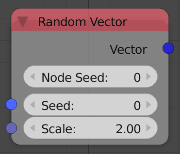
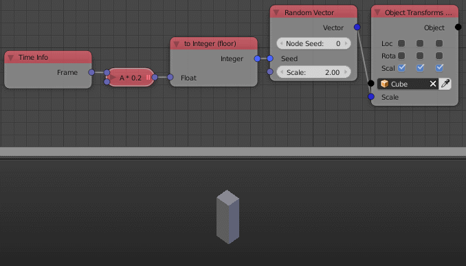

Random Vector
=============

Description
-----------
This node generate a random vector with a defined magnitude.

Inputs
------

- **Seed** - Seed for the random generator, Where different seed generate different random vector.
- **Scale** - The magnitude of the generated vector.

Outputs
-------

- **Vector** - A random vector with magnitude equal to input scale.

Advanced Node Settings
----------------------

- N/A

Note
----

The node has an **extra seed** (*Node Seed*) that can be used to differentiate between nodes with the same seed, e.g., When using multiple *Random vector* nodes in a loop while using the index as a seed, you can change the extra seed to get different results from the other nodes.

Animation Nodes automatically change the *Node Seed* when you duplicate or add a new *Random vector* node.

Examples of Usage
-----------------

