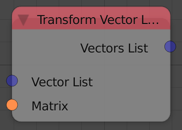
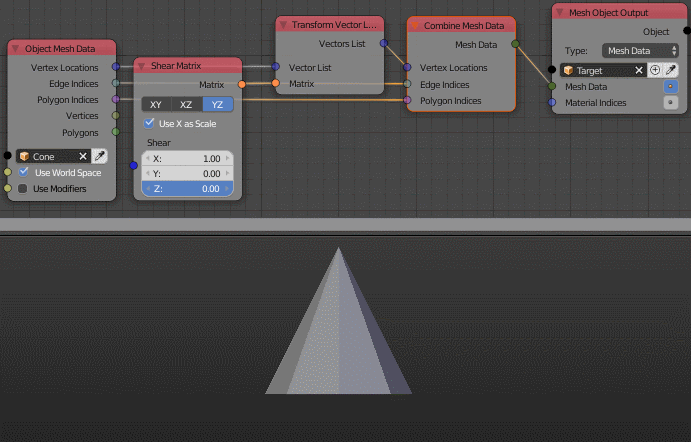

Transform Vector List
=====================

Description
-----------
This node transform a list of points based on an input *Transformation Matrix*.

Inputs
------
 
- **Vector List** - The vectors to transform.
- **Matrix** - A transformation matrix.

Outputs
-------

- **Vector List** - The new coordinates of the points after transformation.

Advanced Node Settings
----------------------

- N/A

Examples of Usage
-----------------

