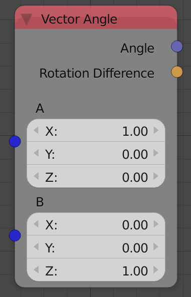
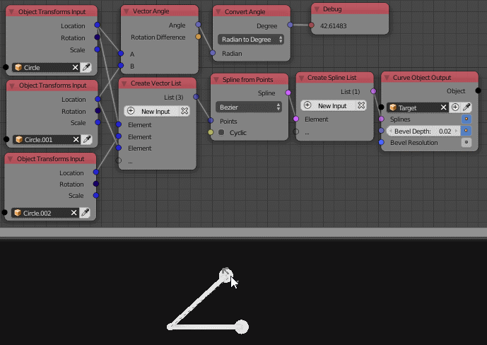

Vector Angle
============

Description
-----------

This node calculates the angle between two vectors.

Inputs
------

- **Vector A** - The first vector.
- **Vector B** - The second vector.

Outputs
-------

- **Angle** - The Angle between the the two input vectors in radian.
- **Rotation Difference** - The difference between the quaternion forms of the 2 vectors in a form of a quaternion.

Advanced Node Settings
----------------------

- N/A

Examples of Usage
-----------------

