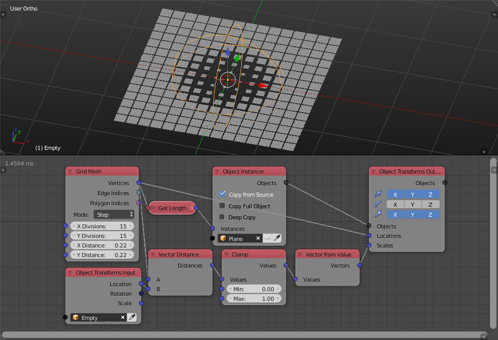
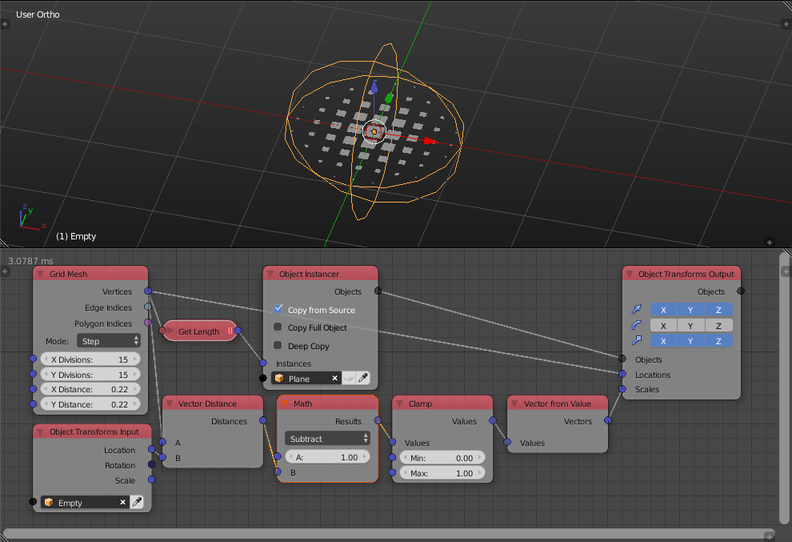

Vector Distance
===============

Description
-----------

This node calculates the distance between two points.

.. image:: images/vector_distance_node.png
   :width: 160pt

Inputs
------

- **Vector A** - The coordinates of the first point.
- **Vector B** - The coordinates of the second point.

Outputs
-------

- **Distance** - The distance between the two input coordinates.

Advanced Node Settings
----------------------

- N/A

Examples of Usage
-----------------

The effect can be reversed by using ``x-d`` where ``x`` is an arbitrary positive number and ``d`` is the distance:

