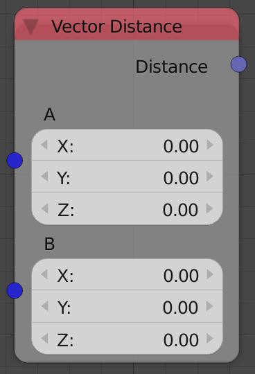
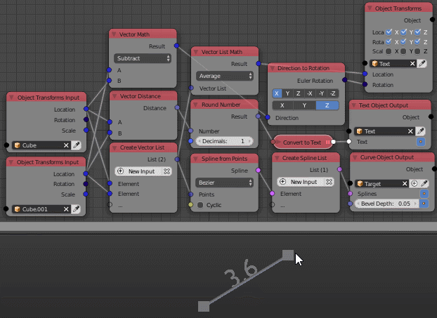

Vector Distance
===============

Description
-----------
This node calculates the distance between 2 points defined by 2 input vectors.

Inputs
------

- **Vector A** - The coordinates of the first point.
- **Vector B** - The coordinates of the second point.

Outputs
-------

- **Distance** - The distance between the 2 input coordinates.

Advanced Node Settings
----------------------

- N/A

Examples of Usage
-----------------

