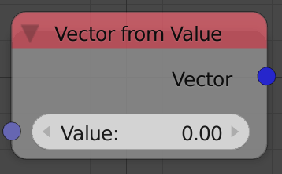
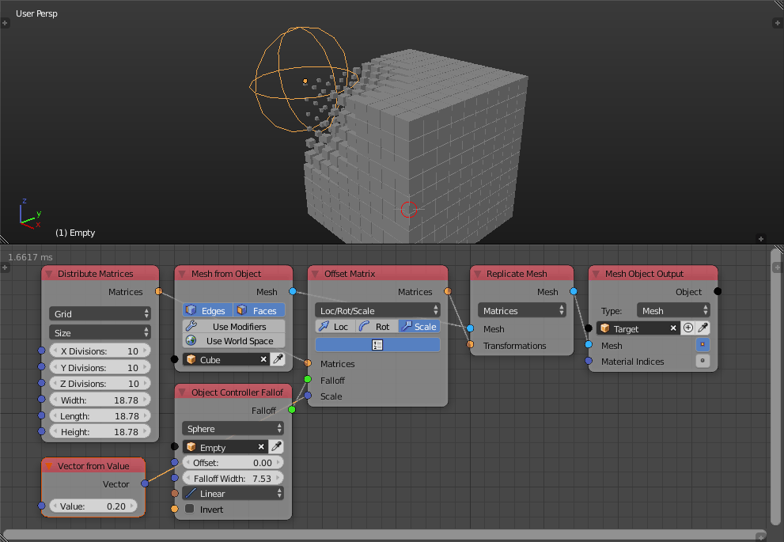

Vector From Value
=================

Description
-----------
This node composes a vector with a uniform value in all of its components.

Inputs
------

- **Value** - A value that is the X,Y and Z component of the output vector.

Outputs
-------

- **Vector** - A vector composed of the input value in all of it's components.

Advanced Node Settings
----------------------

N/A

Examples of Usage
-----------------

