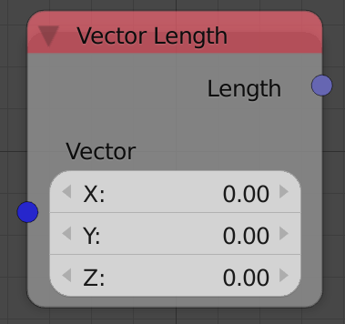
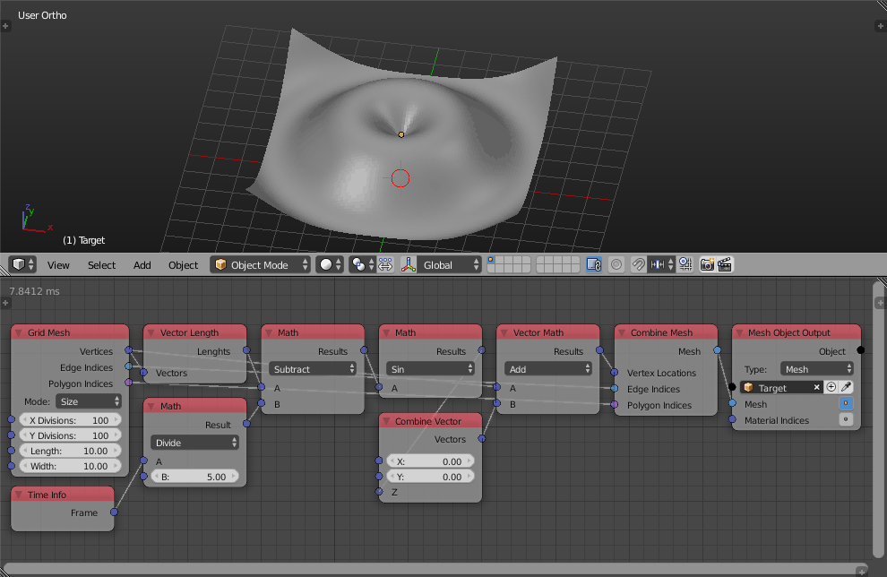

Vector Length
=============

Description
-----------

This node calculates the magnitude of the input vector.

Inputs
------

- **Vector** - A vector to calculate its magnitude.

Outputs
-------

- **Length** - The magnitude of the input vector.

Advanced Node Settings
----------------------

- N/A

Examples of Usage
-----------------

